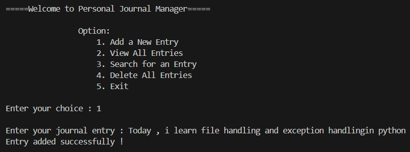
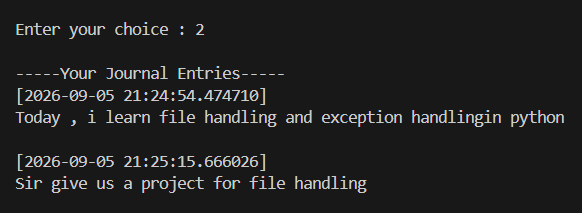
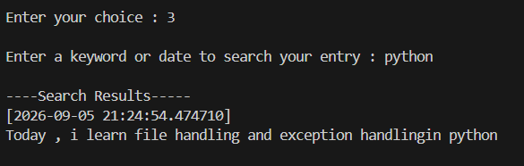
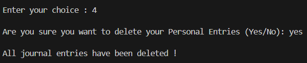
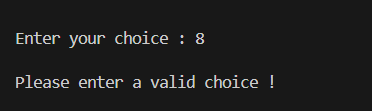
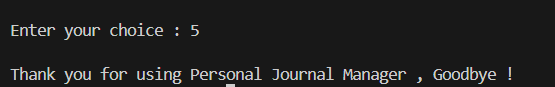

# 6. File Operator

## 📔 Personal Journal Manager
 
A simple command-line journal application built in Python. It lets you add, view, search, and delete personal journal entries, with each entry automatically timestamped and saved to a local text file.
 
## Features
 
- **Add Entry** — Write a new journal entry, automatically saved with the current date and time.
- **View Entries** — Display all saved journal entries in order.
- **Search Entry** — Search entries by keyword or date.
- **Delete All Entries** — Clear your entire journal after a confirmation prompt.
- **Persistent Storage** — Entries are stored in a plain text file (`journal.txt`), so your data stays even after closing the program.
## How It Works
 
The program is built around a `JournalManager` class with the following methods:
 
| Method | Description |
|---|---|
| `addentry()` | Prompts for a new entry and appends it to the journal file with a timestamp. |
| `viewentries()` | Reads and prints all entries from the journal file. |
| `searchentry()` | Searches all entries for a keyword or date and prints matching results. |
| `delete_entry()` | Deletes all entries after user confirmation. |
| `main()` | Runs the interactive menu loop for the application. |
 
On startup, the script checks if `journal.txt` exists at the configured path — if not, it creates an empty file automatically.
 
## Requirements
 
- Python 3.x
- No external libraries required (uses only the built-in `datetime` module)
## Usage
 
When you run the program, you'll see a menu like this:
 
```
=====Welcome to Personal Journal Manager=====
 
Option:
    1. Add a New Entry
    2. View All Entries
    3. Search for an Entry
    4. Delete All Entries
    5. Exit
```
 
Simply enter the number corresponding to the action you want to perform.
 
## Screenshots
 
Here's what a typical session looks like:
 
### 1. Adding a New Entry
 

 
The main menu is shown first. After choosing option `1`, you're prompted to type your entry, which is saved with a timestamp.
 
### 2. Viewing All Entries
 

 
Option `2` prints every saved entry along with the date and time it was written.
 
### 3. Searching for an Entry
 

 
Option `3` lets you search by keyword (or date) and prints any matching entries.
 
### 4. Deleting All Entries
 

 
Option `4` asks for confirmation before permanently clearing the journal file.
 
### 5. Handling an Invalid Choice
 

 
Entering a number outside the menu range shows a friendly error instead of crashing.
 
### 6. Exiting the Program
 

 
Option `5` exits the program with a goodbye message.
 
## Notes & Possible Improvements
 
- Currently, the file path is hardcoded — you could make this configurable via user input or a config file.
- Timestamps include microseconds; formatting them (e.g. `t.strftime("%Y-%m-%d %H:%M:%S")`) would make entries cleaner to read.
- Search matches on exact keyword substrings; a more advanced search (by date range, for example) could be added later.
- Consider adding an "Edit Entry" or "Export Entries" feature for future versions.
## License
 
This project is free to use and modify for personal or educational purposes.